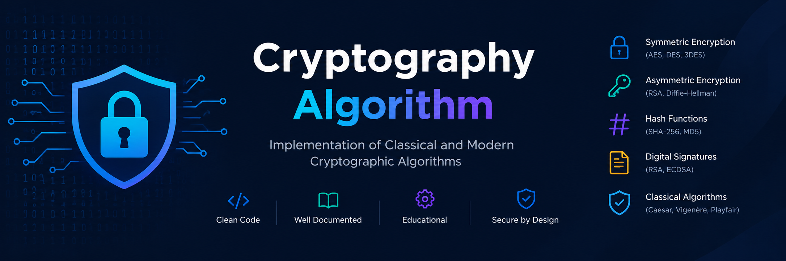

<div align="center">



# Cryptography Algorithm Toolkit

**A comprehensive, modular, and interactive Python CLI toolkit for exploring, understanding, and experimenting with 80+ cryptographic algorithms and protocols.**

[](https://www.python.org/)
[](#-algorithm-coverage-matrix)
[](LICENSE)
[](https://github.com/Aakash02A/Cryptography-Algorithm/stargazers)
[](https://github.com/Aakash02A/Cryptography-Algorithm/issues)
[](SECURITY.md)

</div>

---

> [!WARNING]
> ### Educational and Experimental Disclaimer
> **This project is strictly designed for educational, research, and self-learning purposes.** It has not undergone formal cryptographic security auditing and must **NOT** be used in production environments or to protect sensitive real-world data. Implementations may lack constant-time guarantees, making them susceptible to timing and side-channel vulnerabilities. For production deployments, always rely on battle-tested cryptographic libraries such as [libsodium](https://doc.libsodium.org/), [cryptography](https://cryptography.io/), or Google's [Tink](https://developers.google.com/tink).

---

## 📑 Table of Contents

- [Overview](#-overview)
- [Key Features](#-key-features)
- [Algorithm Coverage Matrix](#-algorithm-coverage-matrix)
- [Getting Started](#-getting-started)
  - [Prerequisites](#prerequisites)
  - [Installation \& Setup](#installation--setup)
  - [Launching the CLI](#launching-the-cli)
- [CLI Navigation \& Shortcuts](#-cli-navigation--shortcuts)
- [Repository Architecture](#-repository-architecture)
- [Documentation \& References](#-documentation--references)
- [Contributing](#-contributing)
- [Security Policy](#-security-policy)
- [License](#-license)

---

## 💡 Overview

The **Cryptography Algorithm Toolkit** provides a single, unified command-line platform to explore cryptographic concepts spanning centuries—from classical pen-and-paper ciphers to modern authenticated encryption and cutting-edge post-quantum cryptography.

Whether you are studying how AES rounds work under the hood, tracing an RSA key generation handshake, experimenting with zero-knowledge proofs, or analyzing lattice-based post-quantum key encapsulation mechanisms, this toolkit provides runnable code, transparent step-by-step breakdowns, and dedicated documentation for each algorithm family.

---

## ✨ Key Features

- 🎓 **80+ Algorithms Across 9 Disciplines:** Spans symmetric ciphers, public-key algorithms, hashing, MACs, AEAD, post-quantum schemes, advanced privacy-preserving cryptography, protocols, and historical systems.
- 💻 **Interactive & Robust CLI:** Intuitive terminal UI with cross-platform screen management, input validation, and resilient error recovery.
- 🔍 **Built-in Diagnostics (`D`):** Instantly test all 83 underlying modules for missing dependencies, syntax validity, and import integrity.
- 🧩 **Modular Architecture:** Cleanly isolated directories per topic with dedicated READMEs, standard interfaces, and standalone execution support.
- 🔬 **Inspect Intermediate States:** Trace mathematical workings, S-Box substitutions, polynomial operations, key schedules, and network protocol handshakes.
- 📜 **Historical & Pedagogical Context:** Includes broken and deprecated algorithms (e.g., DES, RC4, MD5) alongside modern counterparts to teach cryptographic evolution and vulnerability analysis.

---

## 📚 Algorithm Coverage Matrix

| Category | Topics & Algorithms | Modules & Documentation |
| :--- | :--- | :--- |
| **🔐 Symmetric Key Cryptography** | **Block Ciphers:** AES (128/192/256), DES, 3DES, Blowfish, Twofish, Camellia, CAST-128, IDEA, RC2, RC5, RC6, SEED, ARIA, Serpent, SM4, Magma, Kuznyechik<br>**Block Modes:** ECB, CBC, CFB, OFB, CTR, XTS<br>**Stream Ciphers:** ChaCha20, Salsa20, RC4, HC-128, Rabbit, SOSEMANUK, A5/1 | • [Block Ciphers](Modules/Symmetric_Key_Cryptography/Block_Ciphers/README.md)<br>• [Block Cipher Modes](Modules/Symmetric_Key_Cryptography/Block_Cipher_Modes/README.md)<br>• [Stream Ciphers](Modules/Symmetric_Key_Cryptography/Stream_Ciphers/README.md) |
| **🔑 Asymmetric Key Cryptography** | **Public Key Encryption:** RSA, ElGamal, Paillier, Rabin<br>**Key Exchange:** Diffie-Hellman (DH), ECDH, X25519, MQV<br>**Elliptic Curves:** ECDSA, Ed25519, Ed448, Curve25519, SM2<br>**Digital Signatures:** DSA, ECDSA, Schnorr, BLS | • [Public Key Encryption](Modules/Asymmetric_Key_Cryptography/Public_Key_Encryption/README.md)<br>• [Key Exchange](Modules/Asymmetric_Key_Cryptography/Key_Exchange/README.md)<br>• [Elliptic Curve Cryptography](Modules/Asymmetric_Key_Cryptography/Elliptic_Curve_Cryptography/README.md)<br>• [Digital Signatures](Modules/Asymmetric_Key_Cryptography/Digital_Signature_Algorithm/README.md) |
| **🏷️ Hash Functions** | MD5, SHA-1, SHA-2 (SHA-224, SHA-256, SHA-384, SHA-512), SHA-3 (Keccak), BLAKE2, BLAKE3, RIPEMD-160, Whirlpool, Tiger | • [Hash Algorithms](Modules/Cryptographic_Hash_Functions/Hash_Algorithms/README.md) |
| **🛡️ Message Authentication (MAC)** | HMAC (with SHA-256 / SHA-3), CMAC, GMAC, Poly1305 | • [MAC Algorithms](Modules/Message_Authentication/MAC_Algorithms/README.md) |
| **⚡ Authenticated Encryption (AEAD)** | AES-GCM, AES-CCM, ChaCha20-Poly1305, AES-OCB | • [AEAD Schemes](Modules/Authenticated_Encryption_AEAD/Integrated_Encryption_Integrity/README.md) |
| **⚛️ Post-Quantum Cryptography (PQC)** | **KEMs & Encryption:** CRYSTALS-Kyber (ML-KEM), NTRU, Classic McEliece, FrodoKEM<br>**Signatures:** CRYSTALS-Dilithium (ML-DSA), Falcon, SPHINCS+ (SLH-DSA) | • [PQC KEMs](Modules/Post_Quantum_Cryptography/Key_Encapsulation_or_Encryption/README.md)<br>• [PQC Signatures](Modules/Post_Quantum_Cryptography/Post_Quantum_Signature/README.md) |
| **🔮 Advanced Cryptography** | **Homomorphic Encryption:** Paillier additive, BFV / CKKS concepts<br>**Secret Sharing:** Shamir's Secret Sharing (SSSS), Blakley<br>**Secure Computation:** Yao's Garbled Circuits, GMW, Oblivious Transfer<br>**Zero-Knowledge Proofs:** Schnorr ZKP, Sigma protocols, zk-SNARKs overview | • [Homomorphic Encryption](Modules/Advanced_Cryptography/Homomorphic_Encryption/README.md)<br>• [Secret Sharing](Modules/Advanced_Cryptography/Secret_Sharing/README.md)<br>• [Secure Computation](Modules/Advanced_Cryptography/Secure_Computation/README.md)<br>• [Zero-Knowledge Proofs](Modules/Advanced_Cryptography/Zero_Knowledge_Proofs/README.md) |
| **🌐 Cryptographic Protocols** | TLS 1.3 Handshake simulation, SSH-2 Key Exchange, IPsec IKEv2 flow, PGP / OpenPGP Hybrid Encryption, Kerberos Authentication | • [Secure Protocols](Modules/Cryptographic_Protocols/Secure_Communication_Protocols/README.md) |
| **📜 Classical & Historical Ciphers** | Caesar Cipher, Vigenère Cipher, Playfair Cipher, Hill Cipher (Matrix), Enigma Machine Simulation | • [Traditional Ciphers](Modules/Classical_or_Historical_Ciphers/Traditional_Ciphers/README.md) |

---

## 🚀 Getting Started

### Prerequisites

- **Python 3.10 or higher** (Python 3.11+ recommended)
- **Git** installed on your machine
- *(Optional)* C/C++ compiler tools (e.g. GCC/Clang or MSVC) if building optional native extensions like `twofish`, `tiger`, or `whirlpool`.

### Installation & Setup

1. **Clone the repository:**
   ```bash
   git clone https://github.com/Aakash02A/Cryptography-Algorithm.git
   cd Cryptography-Algorithm
   ```

2. **Create and activate a virtual environment:**

   <details open>
   <summary><b>Windows (PowerShell)</b></summary>

   ```powershell
   python -m venv .venv
   .venv\Scripts\Activate.ps1
   ```
   </details>

   <details>
   <summary><b>macOS / Linux (Bash / Zsh)</b></summary>

   ```bash
   python3 -m venv .venv
   source .venv/bin/activate
   ```
   </details>

3. **Install core dependencies:**
   ```bash
   pip install --upgrade pip
   pip install -r requirements.txt
   ```

### Launching the CLI

Start the interactive terminal interface:

```bash
python main.py
```

---

## ⌨️ CLI Navigation & Shortcuts

When running `main.py`, you can quickly jump between sections or execute utilities using these commands:

| Command | Action | Description |
| :---: | :--- | :--- |
| `1` – `9` | **Select Category** | Navigate directly to one of the 9 cryptographic categories |
| `D` / `DIAG` | **Run Diagnostics** | Validates all 83 algorithm modules and verifies dependencies |
| `S` / `SETUP` | **Setup Guide** | Inspects package configuration and regenerates missing package markers |
| `H` / `HELP` | **Command Help** | Displays a summary of all interactive commands and shortcuts |
| `CLS` / `CLEAR` | **Clear Screen** | Clears the terminal output and re-renders the banner |
| `M` / `MAIN` | **Main Menu** | Returns to the top-level main selection screen |
| `Q` / `QUIT` | **Exit** | Gracefully closes the toolkit |

---

## 📁 Repository Architecture

```text
Cryptography-Algorithm/
├── assets/                               # Media, banners, and diagrams
├── Modules/                              # Modular cryptographic implementations
│   ├── Advanced_Cryptography/            # Homomorphic, ZKP, MPC, Secret Sharing
│   ├── Asymmetric_Key_Cryptography/      # Public-key ciphers, Signatures, ECC, Key Exchange
│   ├── Authenticated_Encryption_AEAD/    # GCM, CCM, ChaCha20-Poly1305, OCB
│   ├── Classical_or_Historical_Ciphers/  # Caesar, Vigenère, Playfair, Hill, Enigma
│   ├── Cryptographic_Hash_Functions/     # MD5, SHA families, BLAKE, RIPEMD, Whirlpool
│   ├── Cryptographic_Protocols/          # TLS 1.3, SSH, IPsec, PGP, Kerberos simulations
│   ├── Message_Authentication/           # HMAC, CMAC, GMAC, Poly1305
│   ├── Post_Quantum_Cryptography/        # Kyber, Dilithium, Falcon, SPHINCS+, McEliece
│   └── Symmetric_Key_Cryptography/       # Block ciphers, block modes, stream ciphers
├── samples/                              # Reference test outputs, test vectors, and keys
├── V1/                                   # Original first version — AES, RSA, SHA-256, XOR cipher
├── CONTRIBUTING.md                       # Contribution guidelines & coding conventions
├── DEVELOPMENT.md                        # Architecture details & module authoring guide
├── LICENSE                               # MIT License
├── Method-IOBehavior.md                  # I/O standards & interactive formatting conventions
├── README.md                             # Main documentation entry point
├── SECURITY.md                           # Security policy and vulnerability disclosure
├── main.py                               # Central CLI router and dispatcher
└── requirements.txt                      # Project dependencies
```

---

## 📖 Documentation & References

- 🛠️ **[Development Guide](DEVELOPMENT.md):** Module boilerplate template, coding patterns, and internal architecture.
- 📝 **[Method & I/O Behavior](Method-IOBehavior.md):** Standards for input parsing, hex/byte serialization, and CLI styling.
- 🤝 **[Contribution Guidelines](CONTRIBUTING.md):** How to propose additions, submit PRs, and format cryptographic tests.
- 🔒 **[Security Policy](SECURITY.md):** Scope of educational research and vulnerability reporting procedure.
- 🔑 **[Sample Outputs & Test Vectors](samples/):** Known-answer test samples and cryptographic intermediate values.
- 📦 **[V1 — First Version](V1/):** The original beginner implementation (AES, RSA, SHA-256, custom XOR cipher) preserved as a milestone.

---

## 🤝 Contributing

Contributions that enrich educational clarity, add standard test vectors, implement missing algorithms, or improve documentation are very welcome!

1. **Fork** the repository and create a feature branch (`git checkout -b feature/new-cipher`).
2. Implement your module following the template in [DEVELOPMENT.md](DEVELOPMENT.md).
3. Include RFC/NIST test vectors or known-answer tests where possible.
4. Run diagnostics (`python main.py` -> `D`) to confirm module integrity.
5. Submit a descriptive Pull Request.

Please review [CONTRIBUTING.md](CONTRIBUTING.md) and [CODE_OF_CONDUCT.md](CODE_OF_CONDUCT.md) before submitting.

---

## 🛡️ Security Policy

This repository is maintained for educational and reference purposes. Please report any potential security oversights or inaccuracies by following our [Security Policy](SECURITY.md).

---

## ⚖️ License

Distributed under the **MIT License**. See [`LICENSE`](LICENSE) for complete terms.

<div align="center">

<sub>Designed and developed for cryptography education, research, and technical exploration.</sub><br/>
<sub>Built by <a href="https://github.com/Aakash02A">Aakash</a></sub>

</div>
